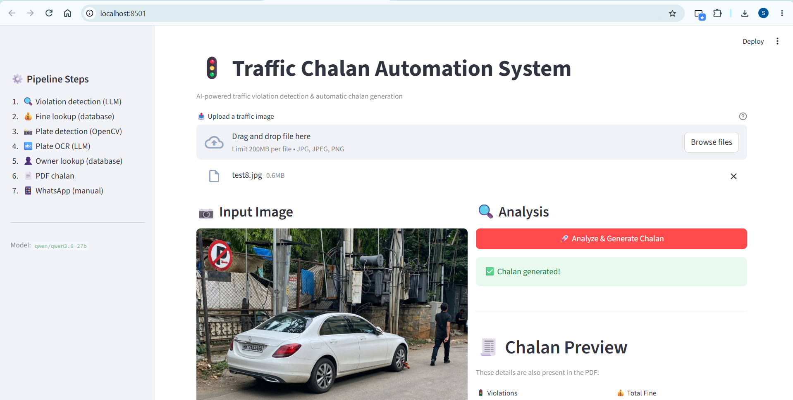
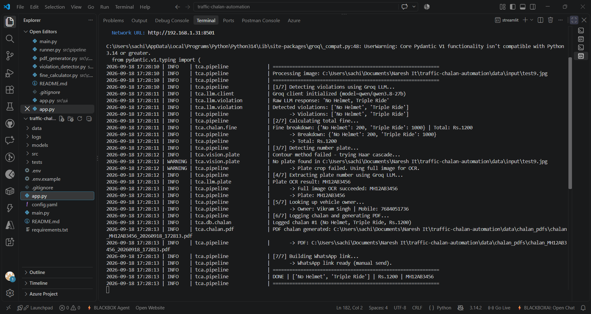
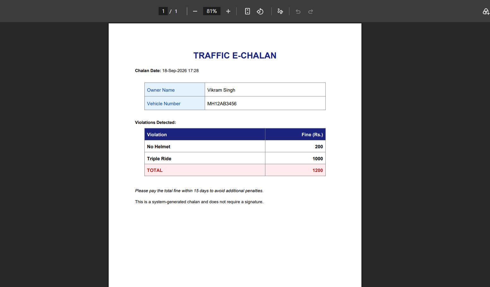

# 🚦 Traffic Chalan Automation System

An AI-powered system that detects traffic violations from images and automatically generates e-chalans with fine details and WhatsApp notifications.


---

## 📌 What This Project Does

When a traffic camera captures an image, this system:

1. Detects the traffic violation in the image (using Groq Vision LLM)
2. Looks up the fine amount from a PostgreSQL database
3. Detects and reads the vehicle's number plate (OpenCV + LLM OCR)
4. Finds the vehicle owner from the database
5. Generates a PDF e-chalan
6. Creates a WhatsApp notification link

Supports **multiple violations in a single image** (e.g., No Helmet + Triple Ride).

---

## ✨ Features

- Detects multiple traffic violations per image
- Number plate detection using Canny edges + Haar cascade
- Fallback to full-image OCR when the plate crop fails
- Fuzzy plate matching to handle small OCR errors (R↔K, 0↔O)
- PDF e-chalan with violation-wise fine breakdown
- WhatsApp notification link for manual sending
- Streamlit web UI + CLI mode
- PostgreSQL backend (two separate databases)
- Structured logging to console and file
- Dockerized and deployed on Azure Container Apps

---

## 🛠️ Tech Stack

| Component | Technology |
|---|---|
| Language | Python 3.10+ |
| Computer Vision | OpenCV |
| LLM / OCR | Groq API (Qwen 3.8) |
| Database | PostgreSQL |
| PDF | ReportLab |
| Web UI | Streamlit |
| Config | YAML + python-dotenv |
| Containerization | Docker |
| Deployment | Azure Container Apps |

---

## 📁 Project Structure

```
traffic-chalan-automation/
├── app.py                  # Streamlit UI
├── main.py                 # CLI entry point
├── config.yaml             # Settings
├── chalan_db.sql           # Database schema (chalan_db)
├── user_db.sql             # Database schema (user_db)
├── Dockerfile
├── requirements.txt
├── .env.example
├── .dockerignore
├── .gitignore
│
├── src/
│   ├── vision/              # Plate detection (OpenCV)
│   ├── llm/                 # Groq LLM calls
│   ├── database/             # PostgreSQL repos
│   ├── chalan/               # Fine + PDF
│   ├── notification/         # WhatsApp link
│   ├── pipeline/              # Orchestrator
│   └── utils/                # Config + logger
│
├── models/                 # Haar cascade XML
├── data/                    # input/output/PDFs
├── docs/                    # Screenshots
├── tests/
└── logs/
```

---

## 🚀 Setup (Local)

### 1. Clone the repository

```bash
git clone https://github.com/YOUR_USERNAME/traffic-chalan-automation.git
cd traffic-chalan-automation
```

### 2. Create a virtual environment

```bash
python -m venv venv
venv\Scripts\activate         # Windows
# source venv/bin/activate    # Linux/Mac
```

### 3. Install dependencies

```bash
pip install -r requirements.txt
```

### 4. Set up the environment file

```bash
copy .env.example .env        # Windows
# cp .env.example .env        # Linux/Mac
```

Edit `.env`:

```env
DB_HOST=localhost
DB_PORT=5432
CHALAN_DB_NAME=chalan_db
USER_DB_NAME=user_db
DB_USER=postgres
DB_PASSWORD=your_password

GROQ_API_KEY=your_groq_api_key
GROQ_VISION_MODEL=qwen/qwen3.8-27b
```

Get a free Groq API key: [console.groq.com/keys](https://console.groq.com/keys)

### 5. Set up PostgreSQL

```bash
createdb chalan_db
createdb user_db

psql -U postgres -d chalan_db -f chalan_db.sql
psql -U postgres -d user_db -f user_db.sql
```

---

## 🎮 Usage

### Streamlit UI

```bash
streamlit run app.py
```

Open `http://localhost:8501`, upload an image, click **Analyze & Generate Chalan**.

### CLI

```bash
python main.py data/input/test3.jpg
```

Example output:

```
============================================================
RESULT
============================================================
Violations  : No Helmet, Triple Ride
Fine breakdown:
  • No Helmet: Rs. 200
  • Triple Ride: Rs. 1000
  ---------------------
  TOTAL: Rs. 1200
Plate       : MH12AB3456
Owner       : Vikram Singh
Mobile      : 7684051736
PDF         : data/chalan_pdfs/chalan_MH12AB3456_xxx.pdf
WhatsApp    : https://wa.me/...
============================================================
```

---

## 🎬 Demo

| Streamlit UI | CLI Output | Generated PDF |
|---|---|---|
|  |  |  |

---

## 🔍 How Plate Detection Works

The system uses a 3-layer fallback:

1. **Canny edge detection + contour analysis** — tries to find the plate first
2. **Haar cascade classifier** — used if the first method fails
3. **Full image sent to LLM** — if the crop still fails or returns `UNREADABLE`

This makes it work on real-world images where the crop isn't always perfect.

---

## ☁️ Azure Deployment

The app is containerized with Docker and deployed on **Azure Container Apps**.

### Architecture

```
┌─────────────────────────────┐      ┌──────────────────────────────┐
│  Azure Container Registry   │      │  Azure Database for          │
│  (ACR)                      │      │  PostgreSQL Flexible Server  │
│  trafficchalanregsachin     │      │  traffic-chalan-db-sachin    │
│                             │      │                              │
│  image: chalan-app:v1       │◄─────┤  Databases:                  │
└──────────────┬──────────────┘      │   - chalan_db                │
               │ pulls image         │   - user_db                  │
               ▼                     └──────────────────────────────┘
┌──────────────────────────┐
│  Azure Container App     │
│  traffic-chalan-app      │
│  (Streamlit, port 8501)  │
│  Public HTTPS URL        │
└──────────────────────────┘
```

### Resources created

| Resource | Name | Region |
|---|---|---|
| Resource Group | `traffic-chalan-rg` | Central India |
| Database Server | `traffic-chalan-db-sachin` | Central India |
| Container Registry | `trafficchalanregsachin` | Central India |
| Container App | `traffic-chalan-app` | Central India |

### 1. Dockerfile

```dockerfile
FROM python:3.11-slim

WORKDIR /app

RUN apt-get update && apt-get install -y --no-install-recommends \
    libglib2.0-0 curl \
    && rm -rf /var/lib/apt/lists/*

COPY requirements.txt .
RUN pip install --no-cache-dir -r requirements.txt

COPY . .

RUN mkdir -p data/input data/output data/chalan_pdfs logs

EXPOSE 8501

CMD ["streamlit", "run", "app.py", \
     "--server.port=8501", \
     "--server.address=0.0.0.0", \
     "--server.headless=true", \
     "--server.enableCORS=false"]
```

**Notes:**
- `opencv-python-headless` is used instead of `opencv-python` to avoid `libGL.so.1` errors in a headless container.
- `.env` is excluded from the image via `.dockerignore` — secrets are injected at runtime through Container App environment variables instead.

### 2. Database setup

Two PostgreSQL databases run on one Flexible Server:

- **`chalan_db`** — tables: `violations`, `chalan_log`
- **`user_db`** — table: `users`

**Local → Azure migration:**

```cmd
:: 1. Backup local databases
"C:\Program Files\PostgreSQL\18\bin\pg_dump.exe" -h localhost -U postgres -d chalan_db --no-owner --no-acl -f chalan_db.sql
"C:\Program Files\PostgreSQL\18\bin\pg_dump.exe" -h localhost -U postgres -d user_db --no-owner --no-acl -f user_db.sql

:: 2. Restore into Azure (SSL required)
set PGSSLMODE=require
"C:\Program Files\PostgreSQL\18\bin\psql.exe" -h traffic-chalan-db-sachin.postgres.database.azure.com -U chalanadmin -d chalan_db -f chalan_db.sql
"C:\Program Files\PostgreSQL\18\bin\psql.exe" -h traffic-chalan-db-sachin.postgres.database.azure.com -U chalanadmin -d user_db -f user_db.sql
```

**Networking:**
- Public access: Enabled
- Firewall rule: *Allow public access from any Azure service within Azure*
- Developer machine IP was added temporarily during migration and removed afterward.

**SSL (required):** Azure PostgreSQL rejects non-SSL connections. `src/database/connection.py`:

```python
def _connect(dbname: str):
    env = config.env
    return psycopg2.connect(
        host=env["DB_HOST"],
        port=env["DB_PORT"],
        dbname=dbname,
        user=env["DB_USER"],
        password=env["DB_PASSWORD"],
        sslmode=os.getenv("DB_SSLMODE", "prefer"),  # "require" on Azure
        connect_timeout=10,
        cursor_factory=psycopg2.extras.RealDictCursor,
    )
```

### 3. Build and push the image

```cmd
az login
docker login trafficchalanregsachin.azurecr.io

docker build -t chalan-app .
docker tag chalan-app trafficchalanregsachin.azurecr.io/chalan-app:v1
docker push trafficchalanregsachin.azurecr.io/chalan-app:v1
```

### 4. Container App configuration

| Setting | Value |
|---|---|
| Image source | Azure Container Registry |
| Registry / Image / Tag | `trafficchalanregsachin.azurecr.io` / `chalan-app` / `v1` |
| CPU / Memory | 1 core / 2 Gi |
| Ingress | Enabled, accepting traffic from anywhere |
| Ingress type | HTTP |
| Target port | `8501` |
| Insecure connections | Not allowed (HTTPS only) |

**Environment variables:**

| Name | Value |
|---|---|
| `DB_HOST` | `traffic-chalan-db-sachin.postgres.database.azure.com` |
| `DB_PORT` | `5432` |
| `DB_USER` | `chalanadmin` |
| `DB_PASSWORD` | *(secret)* |
| `CHALAN_DB_NAME` | `chalan_db` |
| `USER_DB_NAME` | `user_db` |
| `DB_SSLMODE` | `require` |
| `GROQ_API_KEY` | *(secret)* |
| `GROQ_VISION_MODEL` | `qwen/qwen3.8-27b` |

### 5. Post-deployment checklist

- [ ] Open the Application URL from the Container App's Overview page.
- [ ] Upload a test image and confirm the full pipeline runs.
- [ ] Move `DB_PASSWORD` and `GROQ_API_KEY` into **Settings → Secrets**.
- [ ] Enable **Settings → Authentication** — the URL is public and exposes owner names/mobile numbers.
- [ ] Remove the temporary developer-IP firewall rule from the PostgreSQL server.
- [ ] Note: `data/chalan_pdfs` and `logs/` are ephemeral in the container — PDFs are lost on restart. Add Azure Blob Storage if PDFs need to persist.

### 6. Useful commands

```cmd
:: View live logs
az containerapp logs show --name traffic-chalan-app --resource-group traffic-chalan-rg --follow

:: Deploy a new version
docker build -t chalan-app .
docker tag chalan-app trafficchalanregsachin.azurecr.io/chalan-app:v2
docker push trafficchalanregsachin.azurecr.io/chalan-app:v2
az containerapp update --name traffic-chalan-app --resource-group traffic-chalan-rg --image trafficchalanregsachin.azurecr.io/chalan-app:v2

:: Tear down everything (stop billing)
az group delete --name traffic-chalan-rg
```

## 🧠 Notes

- Two PostgreSQL databases keep violation data and user data separate
- Fuzzy matching handles small OCR errors (e.g., `TS09EA4322` → `TS09EA4321`)
- The vision LLM is used twice — violation detection + plate OCR
- WhatsApp messages are sent manually via a generated `wa.me` link
- Docker uses `opencv-python-headless` (regular `opencv-python` fails in containers)
- `tornado==6.4.1` is pinned to fix a Streamlit 1.39 file-upload issue

---

## 👤 Author

**Your Name**

- GitHub: [Sachins179](https://github.com/Sachins179)
- LinkedIn: [Sachin Sakti Ranjan on LinkedIn](www.linkedin.com/in/sachin-sakti-ranjan-78a8bb268)
